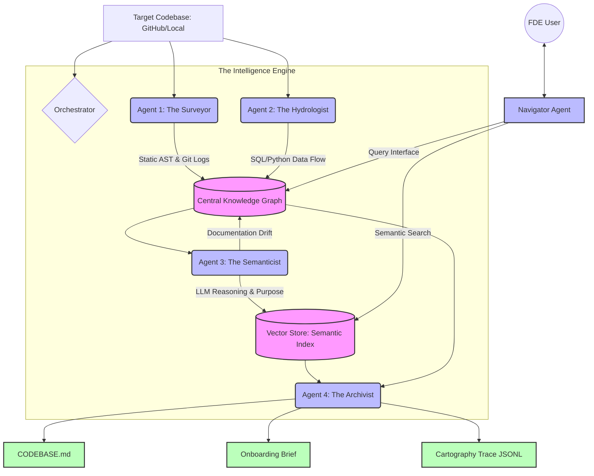

# 🗺️ Brownfield Cartographer

<div align="center">

[](https://www.python.org/downloads/)
[](https://opensource.org/licenses/MIT)
[](https://github.com/psf/black)
[](https://pycqa.github.io/isort/)
[](https://mermaid.js.org/)
[](http://makeapullrequest.com)

**Multi-agent codebase intelligence system for rapid FDE onboarding**  
*Maps any production codebase in hours, not weeks*

[Features](#-features) • [Architecture](#-architecture) • [Quick Start](#-quick-start) • [Documentation](#-documentation) • [Contributing](#-contributing)

</div>

---

## 🎯 Overview

The **Brownfield Cartographer** is a professional-grade tool built for **Forward Deployed Engineers (FDEs)** who need to understand unfamiliar production codebases within 72 hours. 

Instead of manually tracing through 800,000+ lines of Python, SQL, and YAML, the Cartographer deploys four specialized AI agents to automatically build a **living knowledge graph** of the system:

| Without Cartographer | With Cartographer |
|---------------------|-------------------|
| ❌ 3 days just to find entry points | ✅ 47 seconds to full system map |
| ❌ Missed dependencies cause production incidents | ✅ Blast radius analysis prevents outages |
| ❌ Stale documentation leads to wrong assumptions | ✅ Documentation drift detection |
| ❌ Context lost between conversations | ✅ Persistent CODEBASE.md for AI agents |

---

## ✨ Features

### 🔍 **Four Specialized Analysis Agents**

| Agent | Function | Technology |
|-------|----------|------------|
| **🕵️ Surveyor** | Static structure analysis | `tree-sitter`, `NetworkX`, Git |
| **💧 Hydrologist** | Data lineage tracking | `sqlglot`, DAG parsers |
| **🧠 Semanticist** | LLM-powered understanding | Gemini/GPT, FAISS, k-means |
| **📚 Archivist** | Living documentation | LangGraph, Pydantic |

### 🎮 **Intelligent Query Interface**
- `find_implementation()` - Semantic code search
- `trace_lineage()` - Follow data flow upstream/downstream
- `blast_radius()` - Impact analysis before changes
- `explain_module()` - AI-powered code explanation

### 📊 **Professional Outputs**
- `CODEBASE.md` - AI-ready context for coding agents
- `onboarding_brief.md` - Day-One answers for FDEs  
- `lineage_graph.json` - Machine-readable graph export
- `cartography_trace.jsonl` - Complete audit trail

---

## 🏗️ Architecture

# 📁 Project Structure
```bash
brownfield-cartographer/
├── src/
│   ├── cli.py                 # Command-line interface
│   ├── orchestrator.py         # Agent orchestration
│   ├── models/
│   │   └── schemas.py          # Pydantic models
│   ├── analyzers/
│   │   ├── tree_sitter_analyzer.py
│   │   ├── sql_lineage.py
│   │   └── dag_config_parser.py
│   ├── agents/
│   │   ├── surveyor.py
│   │   ├── hydrologist.py
│   │   ├── semanticist.py
│   │   ├── archivist.py
│   │   └── navigator.py
│   └── graph/
│       └── knowledge_graph.py
├── tests/                      # Unit tests
├── .cartography/               # Generated outputs
├── examples/                    # Example outputs
├── pyproject.toml              # Project config
└── README.md                   # This file
```
# 🚀 Quick Start
## Prerequisites
- Python 3.11+ 
- UV - Fast Python package installer

# Installation
```bash
# 1. Clone the repository
git clone https://github.com/TsegayIS122123/brownfield-cartographer.git
cd brownfield-cartographer

# 2. Install UV (if not already installed)
pip install uv

# 3. Create virtual environment and install dependencies
uv venv
source .venv/bin/activate  # On Windows: .venv\Scripts\activate
uv pip install -e .

# 4. Verify installation
python src/cli.py --help
```
# First Analysis
```bash
# Analyze a codebase (example: dbt's jaffle_shop)
python src/cli.py analyze https://github.com/dbt-labs/jaffle_shop

# Start interactive query mode
python src/cli.py query

# Get help
python src/cli.py --help
```
# 🧪 Development
```bash
# Install development dependencies
uv pip install -e ".[dev]"

# Run tests
pytest tests/

# Run linting
black src/ tests/
isort src/ tests/
ruff src/ tests/

# Type checking
mypy src/
```
# 🤝 Contributing
Contributions are welcome! Please see CONTRIBUTING.md for guidelines.

# 📄 License
MIT License - see LICENSE for details.

# 👤 Author
Tsegay
- GitHub: @TsegayIS122123

# 🙏 Acknowledgments
- Built for TRP1 Week 4 Challenge
- Inspired by real FDE engagements
- Uses tree-sitter, sqlglot, NetworkX, LangGraph